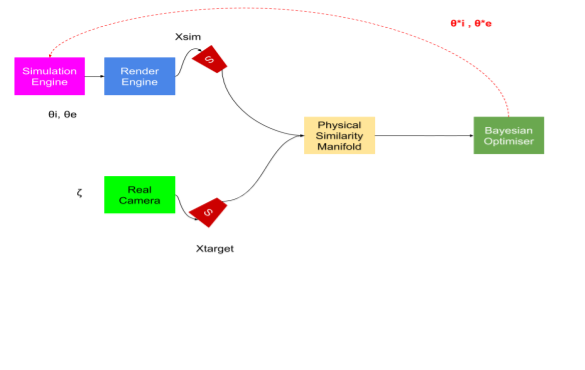
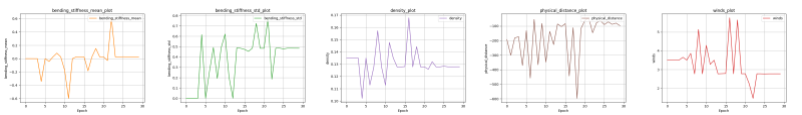
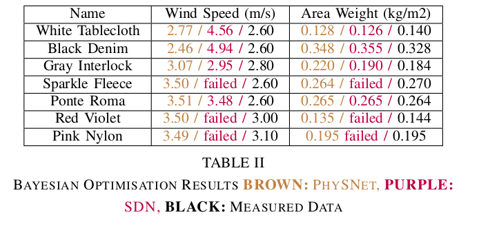
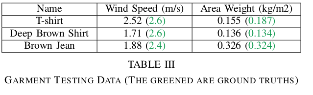

# PhySNet-BayOptim Network
## Introduction
This is a 'PhySNet-BayOptim Network' developed by Li Duan, a PhD student @ University of Glasgow, with Reference from Adam Bielski, a PhD student @ University of Bern.

Figure 1 PhySNet-BayOptim architeture

Figure 2 Database

Figure 3 An example of Bayesian Optimisation results (A piece of white tablecloth fabric)

Figure 4 Results for fabrics

Figure 5 Results for garments

## Downloads
\
 [<a taget="_blank" title="Paper" href="https://www.overleaf.com/read/tgmphznwwxbb">Paper</a>][<a taget="_blank" title="Code" href="https://github.com/LiDuanAtGlasgow/PhySNet-BayOptim/tree/customise">Code</a>][<a taget="_blank" title="Database" href="https://gla-my.sharepoint.com/:u:/g/personal/2168518d_student_gla_ac_uk/EcIEaWoGfJBBvXG7-fmW_-8B4GGhtScCBC4erun6CdJjCA?e=2iFBbZ">Database</a>]

## The Author
\
My name is Li Duan (Ken) and I am a 3rd-year PhD student @ University of Glasgow, Scotland. My interests include robot continuous perception and deformable object manipulation. Recently, I am working on investigating geometric and physical properties of fabrics and garments, from which I am keen on engineering methods to improve robot deformable objetc manipulation.\
I am willing to hear from our community and suggestions are welcomed. Please reach me at:\
Person page: [LI DUAN Ken](https://www.gla.ac.uk/schools/computing/researchstudents/liduan/)\
Twitter: [@liduanglasgow](https://twitter.com/liduanglasgow)\
Email: <em>l.duan.1 at research.gla.ac.uk</em>
